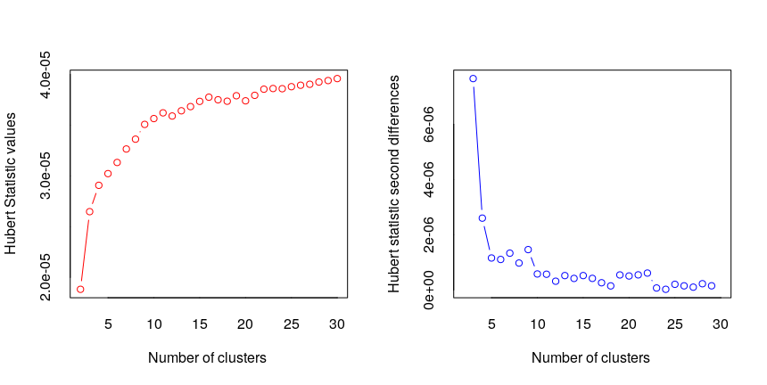
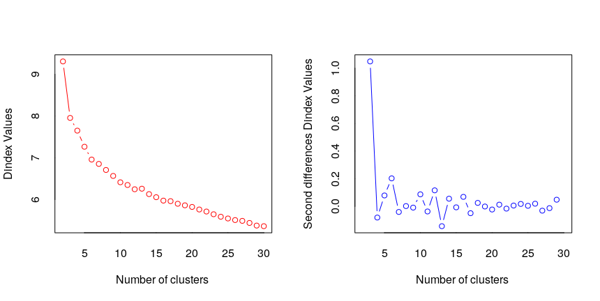
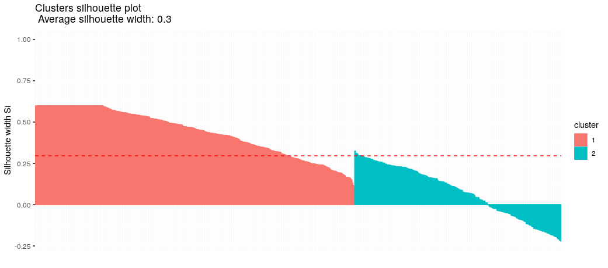
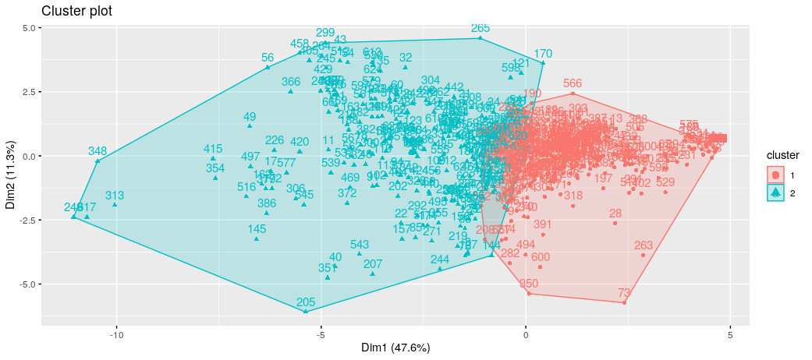
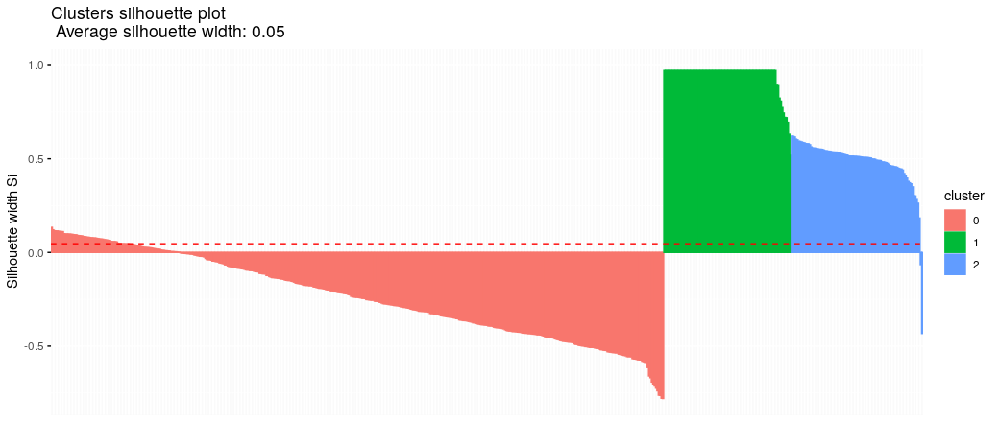

# Assignment

## Task

18 variables:

-   DD_3m_zysk
-   DD_10m_zysk
-   DD_4l_zysk
-   ED_cog_10_zysk
-   ED_cog_40_zysk
-   ED_cog_150_zysk
-   ED_phys_7\_zysk
-   ED_phys_30_zysk
-   ED_phys_100_zysk
-   DD_3m_strata
-   DD_10m_strata
-   DD_4l_strata
-   ED_cog_10_strata
-   ED_cog_40_strata
-   ED_cog_150_strata
-   ED_phys_7\_strata
-   ED_phys_30_strata
-   ED_phys_100_strata

Steps:

1.  Clusterize using k-means and another algorithm.
2.  Check if the output makes sense.
3.  Add information about clusters to the original dataset.

## Processing

``` r
# Preprare
library(cluster)
library(dbscan)
library(dplyr)
library(factoextra)
library(fpc)
library(haven)
library(NbClust)

prokrastynacja <- read_sav("prokrastynacja.sav")
prokrastynacja2 = prokrastynacja %>%
  select(SC15, SC16, SC17, SC18, SC19, SC20, SC21, SC22, SC23, SC24, SC25, SC26, SC27, SC28, SC29, SC30, SC31, SC32)

set.seed(2137)
```

### k-means

`NbClust` for k-means clustering suggests splitting dataset into 2 subsets.
Silhouette show that the data is somewhat poorly matched, though, with some
points having negative value. This stems from the fact that all the points must
be assigned to a cluster and this does not work well with outliers or
high-variance data. Using a higher number of clusters may be beneficial in this
case as the outliers would be more fragmented but this does not solve the
problem completely.

``` r
nb = NbClust(prokrastynacja2, max.nc=30, method="kmeans")
# *** : The Hubert index is a graphical method of determining the number of clusters.
#                 In the plot of Hubert index, we seek a significant knee that corresponds to a 
#                 significant increase of the value of the measure i.e the significant peak in Hubert
#                 index second differences plot. 
#  
# *** : The D index is a graphical method of determining the number of clusters. 
#                 In the plot of D index, we seek a significant knee (the significant peak in Dindex
#                 second differences plot) that corresponds to a significant increase of the value of
#                 the measure. 
#  
# ******************************************************************* 
# * Among all indices:                                                
# * 8 proposed 2 as the best number of clusters 
# * 8 proposed 3 as the best number of clusters 
# * 2 proposed 4 as the best number of clusters 
# * 1 proposed 18 as the best number of clusters 
# * 1 proposed 26 as the best number of clusters 
# * 2 proposed 29 as the best number of clusters 
# * 1 proposed 30 as the best number of clusters 
# 
#                    ***** Conclusion *****                            
#  
# * According to the majority rule, the best number of clusters is  2 
#  
#  
# *******************************************************************
```

 

``` r
k = kmeans(prokrastynacja2, 2)
# K-means clustering with 2 clusters of sizes 382, 247
# 
# Cluster means:
#       SC15     SC16     SC17     SC18     SC19     SC20     SC21     SC22     SC23     SC24     SC25     SC26
# 1 1.837696 2.151832 3.479058 1.434555 1.740838 2.554974 1.568063 1.803665 2.314136 1.230366 1.353403 1.732984
# 2 3.295547 4.238866 6.356275 3.311741 4.716599 7.400810 3.825911 5.040486 6.890688 2.850202 3.400810 4.429150
#       SC27     SC28     SC29     SC30     SC31     SC32
# 1 1.596859 1.714660 2.225131 1.646597 1.759162 2.083770
# 2 3.882591 5.149798 7.246964 4.392713 5.562753 7.101215
# 
# Clustering vector:
#   [1] 1 2 2 1 2 1 1 1 1 1 2 1 1 1 1 1 2 2 1 2 2 2 1 2 1 1 1 1 1 2 2 2 1 2 1 2 1 1 1 2 1 1 2 1 2 2 2 2 2 1 2 1 1
#  [54] 2 1 2 2 1 1 2 1 1 1 2 1 2 1 2 1 1 1 2 1 1 2 1 1 1 1 1 2 2 1 2 2 2 1 1 1 1 2 2 1 2 1 1 1 1 1 1 1 2 1 1 1 1
# [107] 1 2 2 1 2 1 2 2 2 1 1 2 2 1 2 1 2 2 2 1 2 1 2 2 1 1 2 2 2 2 1 2 1 1 2 1 2 2 2 1 1 1 2 1 1 1 2 1 1 2 2 1 2
# [160] 2 1 2 2 2 2 1 1 2 2 2 1 2 1 2 1 1 2 2 2 2 2 2 2 1 1 1 1 2 1 1 1 2 1 1 1 1 1 1 2 2 1 2 1 1 2 1 2 1 1 2 1 2
# [213] 1 1 2 1 1 1 2 1 1 1 2 2 1 2 1 1 1 2 1 1 2 1 1 1 1 1 2 1 1 2 1 2 2 1 1 2 2 1 1 1 2 1 2 1 1 1 2 1 2 2 1 2 2
# [266] 1 2 1 1 1 2 1 1 1 1 1 1 1 1 1 1 1 1 1 1 2 1 1 1 1 1 2 1 1 2 1 1 2 2 2 1 1 1 2 2 2 1 1 1 1 2 1 2 1 1 2 2 1
# [319] 1 1 2 1 1 1 1 1 2 2 1 2 1 2 1 1 1 2 1 1 2 1 2 2 1 1 1 1 2 2 2 1 2 1 2 2 2 2 1 1 1 1 1 1 1 1 1 2 1 1 1 1 1
# [372] 2 1 1 1 2 2 2 2 1 1 2 1 2 1 2 1 1 1 1 1 1 1 1 1 1 2 1 1 1 1 1 2 2 2 1 2 2 1 1 1 2 1 2 2 2 1 1 1 2 2 2 1 2
# [425] 1 2 2 2 2 1 2 1 1 2 1 1 1 2 2 2 1 2 1 1 1 1 1 1 1 1 1 2 2 1 1 2 1 2 1 2 2 1 2 1 2 2 1 2 2 1 1 1 2 1 2 1 1
# [478] 2 1 1 1 1 1 2 2 2 1 1 1 1 1 2 1 1 2 1 2 2 1 1 1 2 2 2 1 1 1 1 1 1 2 2 1 1 1 2 1 1 1 1 1 1 1 1 2 2 1 2 1 2
# [531] 1 2 1 1 1 1 2 1 2 1 2 1 2 1 2 1 1 1 2 2 1 1 1 1 2 1 1 1 1 1 2 2 1 1 1 1 2 1 2 1 1 1 1 2 1 1 2 1 2 2 2 1 1
# [584] 1 1 1 2 1 1 2 2 1 1 1 1 1 2 2 1 1 1 1 1 1 1 1 1 2 2 1 2 1 2 1 2 1 2 1 2 2 2 2 1 2 1 1 2 1 1
# 
# Within cluster sum of squares by cluster:
# [1] 25159.01 40259.04
#  (between_SS / total_SS =  30.4 %)
sk = silhouette(k$cluster, dist(prokrastynacja2))
fviz_silhouette(sk)
fviz_cluster(k, prokrastynacja2)

prokrastynacja_kmeans = prokrastynacja %>% mutate(cluster = k$cluster)
write_sav(prokrastynacja_kmeans, "prokrastynacja_kmeans.sav")
```




### HDBSCAN

Since it seems we deal with high number of outliers, after careful consideration
HDBSCAN algorithm has been chosen to split the data as it is profiles the output
based on point density rather than some fixed number of subsets.

The output is much more favorable. 2 clusters are yielded again, though this
time all the outliers are eliminated and Silhouette values are consistent and
positive, with inflection point clearly visible.

``` r
h = hdbscan(prokrastynacja2, 5, verbose = TRUE)
# HDBSCAN clustering for 629 objects.
# Parameters: minPts = 5
# The clustering contains 2 cluster(s) and 442 noise points.
#
#   0   1   2 
# 442  92  95
sh = silhouette(h$cluster, dist(prokrastynacja2))
fviz_silhouette(sh)

prokrastynacja_hdbscan = prokrastynacja %>% mutate(cluster = h$cluster)
write_sav(prokrastynacja_hdbscan, "prokrastynacja_hdbscan.sav")
```


